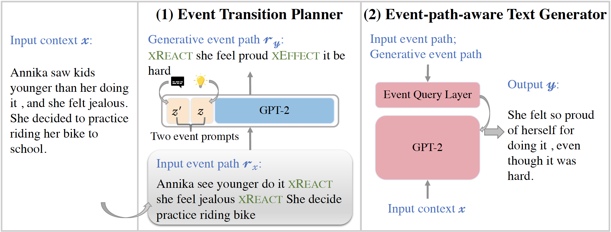

# Event Transition Planning for Open-ended Text Generation

This is the repository of the paper, [Event Transition Planning for Open-ended Text Generation](xxx), by [Qintong Li](https://yuchenlin.xyz/), Piji Li, Wei Bi, Zhaochun Ren, Yuxuan Lai, and Lingpeng Kong, in ACL 2022 Findings. 

:confounded

Make an apology: the original / complete code was stored on a server, which was recycled long long ago... Succumb to Procrastination... 
Therefore the following code is tried to reconstruct based on my local records. 
Sorry again for the late upload.

---



--- 

## Requirements
```
python version >= 3
torch version >= 1.4.0
transformers == 2.8.0
nltk == 3.4.5
networkx == 2.1
spacy == 2.2.1
torch-scatter == 2.0.5+${CUDA}
```

For `torch-scatter`, `${CUDA}` should be replaced by either `cpu`, `cu92`, `cu101` or `cu102` depending on your PyTorch installation. 
For more information check [here](https://github.com/rusty1s/pytorch_scatter).


## Datasets
- External event transition source: [ATOMIC](https://www.kaggle.com/gaussmake1994/atomic-knowledge-graph).   

- Downstream datasets: [ROCStories](http://cs.rochester.edu/nlp/rocstories/) and [EmpatheticDialogues](https://dl.fbaipublicfiles.com/parlai/empatheticdialogues/empatheticdialogues.tar.gz).


## Event Transition Path Preparation
The event transition  path is defined as an alternating sequence between events and relations (we call it event transition path), where an event is a subject-verb phrase, a relation is chosen from a pre-defined label set (e.g., OREACT: object reaction; XATTR: subject attribute) of a commonsense atlas ATOMIC.

We first sample a large amount of event transition paths extracted from external source ATOMIC.
To adapt each downstream task, we also collect event transition paths from the  training set of each specific task.

### Sampling Paths from ATOMIC
```bash
cd data/atomic
python preprocess.py  # including six steps to process the atomic data.
```

Collect {source: <head_event, tail_event>, target: relation} to train a BERT-based relation classifier.
```bash
python get_event_triples.py
```


### Extracting Paths from Downstream Datasets.
First, you need install [ASER](https://hkust-knowcomp.github.io/ASER/html/tutorial/get-started.html#installation), an event extraction toolkit.
```bash
git clone https://github.com/HKUST-KnowComp/ASER.git
pip install -r requirements.txt
python setup.py install
```
After finishing the installation, run ```aser-server -n_workers 1 -n_concurrent_back_socks 10 -port 8000 -port_out 8001 -corenlp_path "YOUR_DIRECTORY/stanford-corenlp-3.9.2" -base_corenlp_port 9000```.
```bash
cd ..
cd data/empatheticdialogues
python preprocess.py "YOUR_DIRECTORY/stanford-corenlp-3.9.2" # including four steps to process the atomic data.
cd ..
cd data/rocstories
python preprocess.py "YOUR_DIRECTORY/stanford-corenlp-3.9.2" # including four steps to process the atomic data.
```

Then train a BERT classifier using event triples and relations in ATOMIC.
```bash
cd ..
cd event_relation_classifier
CUDA_VISIBLE_DEVICES=0 python classifier.py --mode train_test --warmup_ratio 0.1 
```

We use the event relation classifier to complete the event transition path for downstream datasets.
```bash
# dialogue
CUDA_VISIBLE_DEVICES=0 python classifier.py --mode infer_dialogue

# story
CUDA_VISIBLE_DEVICES=0 python classifier.py --mode infer_story
```

You could also skip the above processing steps.
The processed dataset is available at [Dropbox]().  


## Model Training and Inference


mkdir -p gpt2-small
wget -O pytorch_model.bin https://s3.amazonaws.com/models.huggingface.co/bert/gpt2-pytorch_model.bin
wget -O vocab.json https://s3.amazonaws.com/models.huggingface.co/bert/gpt2-vocab.json
wget -O merges.txt https://s3.amazonaws.com/models.huggingface.co/bert/gpt2-merges.txt
wget -O config.json https://s3.amazonaws.com/models.huggingface.co/bert/gpt2-config.json

### Event Transition Planner
- Data preparation


- Training


- Inference


### Event-path-aware Text Generation

- Data preparation


- Training


- Inference

## Citation
```bib
@inproceedings{li-etal-2021-EP4TG,
    title = "Event Transition Planning for Open-ended Text Generation",
    author = "Li, Qintong and Li, Piji and Bi, Wei and Ren, Zhaochun and Lai Yuxuan and Kong Lingpeng",
    booktitle = "xxx",
    year = "2022",
    address = "Online",
    publisher = "Association for Computational Linguistics",
    url = "xxx",
    pages = "xxx"
}
```

## Contact
Please email ***qtleo@outlook.com*** if you have any questions.
